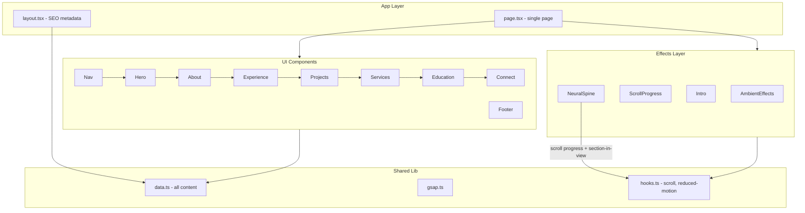

# Fagun Raithatha — Portfolio V2

An elegantly designed, animation-driven portfolio for an ML Engineer and AI Systems builder.

[](https://nextjs.org/)
[](https://react.dev/)
[](https://www.typescriptlang.org/)
[](https://threejs.org/)
[](https://gsap.com/)
[](https://tailwindcss.com/)

**[Live (V2)](https://fagunraithatha.dev)** · **[V1 Portfolio](https://portfolio-tau-swart-70.vercel.app/)** · **[GitHub](https://github.com/fagun98/)** · **[LinkedIn](https://www.linkedin.com/in/fagun-raithatha-4365a2178/)**

<!-- Optional: add a screenshot after deploy -->
<!--  -->

---

## About This Project

This is **Portfolio V2** — a ground-up rebuild of my personal site with refined typography, scroll-synced animations, and a neural-network-inspired visual language. The previous version remains live at [portfolio-tau-swart-70.vercel.app](https://portfolio-tau-swart-70.vercel.app/).

The site is a single-page application that walks visitors through six sections:

**Hero → About → Experience → Projects → Services → Education → Connect**

It showcases work in RAG pipelines, multi-agent systems, cloud AI infrastructure, and compliance-aware architecture — the same domains reflected in my professional experience at NumInformatics and Indiana University.

This project was developed through **AI-assisted pair programming** with [Claude](https://anthropic.com/claude) and [Codex](https://openai.com/codex). Architecture, content direction, and design decisions were human-led; implementation, iteration, and polish were accelerated with AI coding tools.

---

## Features

### Neural Spine (animated centerpiece)

A fixed center-axis visualization built with React Three Fiber. An axon tube draws progressively as you scroll, with signal pulses traveling along the path, section nodes lighting up as each area enters view, floating particles, and dendrite arrival animations. Synced to scroll progress and active section via custom hooks.

→ [`src/components/NeuralSpine.tsx`](src/components/NeuralSpine.tsx)

### Intro overlay

A one-time cinematic intro on first visit, tracked via `sessionStorage` so returning visitors skip straight to content.

→ [`src/components/Intro.tsx`](src/components/Intro.tsx)

### Hero depth typography

Layered name typography with sketch portraits and mouse-driven parallax on desktop. Includes a mechanical keyboard-style quick nav with shortcuts (`E` Experience, `P` Projects, `S` Services, `D` Education).

→ [`src/components/Hero.tsx`](src/components/Hero.tsx) · [`src/components/HeroDepthName.tsx`](src/components/HeroDepthName.tsx) · [`src/components/KeyboardNav.tsx`](src/components/KeyboardNav.tsx)

### Ambient panels

On wide screens (≥1200px), animated side panels simulate a code editor and a LangGraph-themed thought-trace terminal — reinforcing the AI systems theme without leaving the hero.

→ [`src/components/HeroAmbientPanels.tsx`](src/components/HeroAmbientPanels.tsx)

### Scroll-driven animations

GSAP ScrollTrigger powers section reveals, margin widgets, and a fixed amber scroll progress bar. Ambient effects layer ribbons, scanlines, a subtle grid, and film grain across the page.

→ [`src/lib/gsap.ts`](src/lib/gsap.ts) · [`src/components/ScrollProgress.tsx`](src/components/ScrollProgress.tsx) · [`src/components/AmbientEffects.tsx`](src/components/AmbientEffects.tsx)

### Accessibility

Respects `prefers-reduced-motion` across components. The Neural Spine animation is disabled on mobile (≤767px) and when reduced motion is requested. Decorative elements use `aria-hidden`; navigation includes ARIA labels and a mobile drawer with focus trapping.

→ [`src/lib/hooks.ts`](src/lib/hooks.ts)

---

## Tech Stack

| Layer | Technology |
|-------|------------|
| Framework | [Next.js 16](https://nextjs.org/) (App Router), [React 19](https://react.dev/), [TypeScript 5.9](https://www.typescriptlang.org/) |
| Visual effects | [Three.js](https://threejs.org/), [React Three Fiber](https://docs.pmnd.rs/react-three-fiber), [Drei](https://github.com/pmndrs/drei) |
| Animation | [GSAP 3](https://gsap.com/) + ScrollTrigger |
| Styling | [Tailwind CSS 3.4](https://tailwindcss.com/), custom design tokens in [`src/app/globals.css`](src/app/globals.css) |
| Fonts | Inter + Space Grotesk via `next/font/google` |
| Icons | [Lucide React](https://lucide.dev/) + custom brand SVGs |

---

## Architecture



`NeuralSpine` is dynamically imported with `ssr: false` in [`src/app/page.tsx`](src/app/page.tsx) because WebGL rendering is client-only. All portfolio content is centralized in [`src/lib/data.ts`](src/lib/data.ts) — components read from this single source of truth.

---

## Project Structure

```
.
├── public/
│   └── assets/              # Portrait images (face-forward.png, face-upward.png)
├── src/
│   ├── app/
│   │   ├── layout.tsx       # Root layout, fonts, SEO metadata
│   │   ├── page.tsx         # Single-page home (all sections)
│   │   └── globals.css      # Design tokens, animations, ambient styles
│   ├── components/          # 22 UI and animated components
│   └── lib/
│       ├── data.ts          # ← Edit all portfolio content here
│       ├── gsap.ts          # GSAP + ScrollTrigger setup
│       ├── hooks.ts         # Scroll progress, reduced-motion, section tracking
│       └── utils.ts         # cn(), lerp()
├── package.json
├── tailwind.config.ts
└── next.config.mjs
```

---

## Getting Started

### Prerequisites

- **Node.js** 18.18+ or 20+ (compatible with Next.js 16)
- **pnpm** recommended (`pnpm-lock.yaml` is included); npm and yarn also work

### Install and run

```bash
git clone <repo-url>
cd fagun-portfolio
pnpm install
pnpm dev
```

Open [http://localhost:3000](http://localhost:3000) in your browser.

### Scripts

| Script | Command | Purpose |
|--------|---------|---------|
| `dev` | `pnpm dev` | Start development server |
| `build` | `pnpm build` | Create production build |
| `start` | `pnpm start` | Serve production build |
| `lint` | `pnpm lint` | Run ESLint |

---

## Customization

All portfolio copy, links, and section content live in **[`src/lib/data.ts`](src/lib/data.ts)**. Edit these exports to update the site without touching component code:

| Export | What it controls |
|--------|------------------|
| `PERSONAL` | Name, title, location, email, social links, tagline, footer note |
| `SITE_META` | SEO title, description, keywords, canonical URL |
| `NAV_ITEMS` / `SECTION_IDS` | Navigation labels and section order |
| `ABOUT` | Bio text and metric pills |
| `EXPERIENCE` | Work history with expandable roles and tech chips |
| `PROJECTS` | Featured projects with live/source links |
| `SERVICES` | Service offerings |
| `EDUCATION` | Degrees and institutions |
| `KEYBOARD_NAV_ITEMS` | Hero keyboard shortcut keys |

### Design tokens

Color palette is defined in [`tailwind.config.ts`](tailwind.config.ts):

| Token | Value | Usage |
|-------|-------|-------|
| `ink` | `#1a1a1a` | Primary text |
| `amber` | `#EF9F27` | Accent, scroll progress, neural spine |
| `teal` | `#1D9E75` | Signal pulses, secondary accent |
| `purple` | `#534AB7` | Tertiary accent |

Additional CSS variables and ambient animations are in [`src/app/globals.css`](src/app/globals.css).

---

## Deployment

This is a standard Next.js app. [Vercel](https://vercel.com/) is the recommended host (`.vercel/` is already in `.gitignore`).

```bash
pnpm build
```

**Notes:**

- No environment variables are required — the site URL and metadata are hardcoded in `data.ts`
- Update `SITE_META.url` in [`src/lib/data.ts`](src/lib/data.ts) if deploying to a different domain
- [`next.config.mjs`](next.config.mjs) is minimal (`reactStrictMode: true` only)

---

## Performance and Accessibility

| Behavior | Detail |
|----------|--------|
| Spine animation disabled on mobile | Neural Spine does not render at viewports ≤767px |
| Reduced motion | All animations respect `prefers-reduced-motion: reduce` |
| Ambient panels | Hero side panels only render at ≥1200px |
| Decorative elements | Animated canvas and ambient overlays use `aria-hidden` |
| Navigation | Sticky nav with active section highlight; mobile drawer with focus trap |
| Keyboard access | Hero mechanical keys and standard tab navigation throughout |

---

## AI Development Attribution

This project was developed through AI-assisted pair programming with **Claude** and **Codex**. Architecture, content direction, and design decisions were human-led; implementation, iteration, and polish were accelerated with AI coding tools.

---

## Links

| Resource | URL |
|----------|-----|
| Live site (V2) | [fagunraithatha.dev](https://fagunraithatha.dev) |
| Portfolio V1 | [portfolio-tau-swart-70.vercel.app](https://portfolio-tau-swart-70.vercel.app/) |
| GitHub | [github.com/fagun98](https://github.com/fagun98/) |
| LinkedIn | [fagun-raithatha](https://www.linkedin.com/in/fagun-raithatha-4365a2178/) |
| Email | [fagun.raithatha28@gmail.com](mailto:fagun.raithatha28@gmail.com) |
| Product | [smartpal.org](https://smartpal.org/) |

---

Built with Next.js, Three.js, and GSAP · © 2026 Fagun Raithatha
